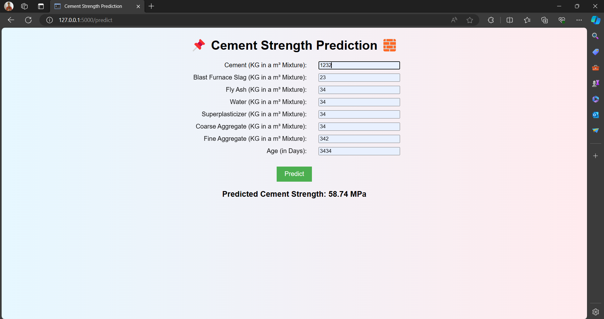

# Machine Learning Project

## Cement Strength Prediction
The Cement Strength Prediction project aims to develop a machine learning model that can accurately predict the strength of cement based on various factors such as the composition of ingredients, curing time, and environmental conditions. By analyzing these factors, the project aims to provide insights into the performance of cement and support decision-making processes in the construction industry.
```bash

- Got 98.32% Accuracy on this Project from Random Forest Regressor
```
### Github Project Link:-

```bash
https://github.com/Abhishek4209/cement-strength-prediction-Advanced-Project
```

## Problem Statement:

```bash

The construction industry requires accurate predictions of cement strength to ensure the structural integrity and durability of buildings and infrastructure. The goal of this project is to build a predictive model that can estimate the strength of cement based on given input parameters. This information can assist engineers, architects, and construction professionals in making informed decisions about material selection and design optimization.
```

## Dataset Information

```bash
The dataset used in this project contains information about various attributes related to cement composition and curing conditions. The target variable is the compressive strength of the cement, which is measured in megapascals (MPa). The dataset includes the following features:

- Cement: Amount of cement (in kg/m³)
- Blast Furnace Slag: Amount of blast furnace slag (in kg/m³)
- Fly Ash: Amount of fly ash (in kg/m³)
- Water: Amount of water (in kg/m³)
- Superplasticizer: Amount of superplasticizer (in kg/m³)
- Coarse Aggregate: Amount of coarse aggregate (in kg/m³)
- Fine Aggregate: Amount of fine aggregate (in kg/m³)
- Age: Curing time (in days)

```

## Create a New Environment for the Project:

```bash

Using anaconda
```
conda create -p cement python==3.12
```
To acivate the environment
```
conda activate cement

```
## Usage
```bash
The Cement Strength Prediction project offers valuable insights and practical applications for various stakeholders involved in the construction industry. Here are a few examples of how the predictions generated by the project can be utilized:

- Material Selection: Engineers and architects can use the predicted cement strength to make informed decisions about material selection for construction projects. By considering the expected strength values, they can choose the appropriate cement composition and optimize the design for durability and safety.

- Quality Control: Construction companies can utilize the predictive model to monitor and assess the quality of cement used in their projects. By comparing the predicted strength with the actual measured strength, they can identify potential issues and take corrective actions to ensure the desired performance of the cement.

- Structural Design Optimization: The predicted cement strength can assist in optimizing the structural design of buildings and infrastructure. By incorporating the estimated strength values into design calculations, engineers can optimize the material usage, reduce costs, and ensure the structural integrity of the constructed elements.

- Performance Evaluation: The predictions can be used to evaluate the performance of different cement compositions and curing conditions. By comparing the predicted strengths of various mixtures, researchers and manufacturers can identify the most effective combinations and refine the manufacturing processes.

- Research and Development: The predictive model can serve as a valuable tool for researchers and scientists working on improving cement formulations. By analyzing the relationships between the input features and the predicted strength, they can gain insights into the underlying factors affecting cement performance and guide future advancements in the field.

It is important to note that the predictions generated by the Cement Strength Prediction project should be used as a tool to support decision-making processes. They should be interpreted in conjunction with domain expertise and other relevant factors to ensure accurate and informed decision-making in the construction industry.
```


### **Output interface:-**

